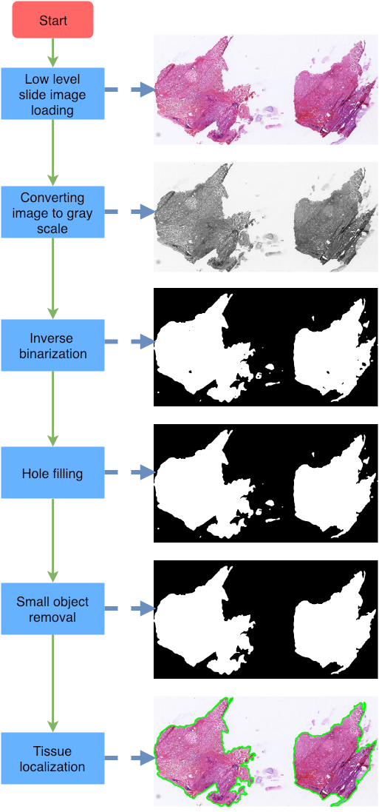

# Summary
Automatic whole slide image (WSI) diagnosis is gradually becoming a research hotspot in biomedical imaging domain [@barker2016automated][@cruz2014automatic]. Because of the gigabyte size of WSI, patch-based method is the de facto manner to deal with WSI, instead of directly taking the WSI as input [@chen2018automatic]. Considering the large while background region as well as computational cost, tissue localization should be the first step for automatic WSI diagnosis. Then we can just focus on those patches inside the tissue regions.

``tissueloc`` is a python-based package written for whole slide pathology image tissue localization, which mainly contains two functionalities. First, selecting the proper level for the following tissue localization. Since the width and height of WSI is far more than 10,000 pixels and WSI has pyramid storage structure, we can select a low level image with much smaller size. This selection is based on the setting of maximum width or height the low level slide image could be, and then selecting the low level image with size just smaller than the setting. Second, tissue localization utilizes a series of basic image processing techniques. The main procedures include: 1) Low level slide image loading. 2) Color space conversion. 3) Inverse binarization. 4) Hole filling. 5) Small object removal.

This whole slide tissue localization is entirely based on basic image processing algorithms, which is extremely fast and could act as a preprocessing step for whole slide image automatic analysis. The parameters used in the processing may need to change according to specific application.

# Acknowledgement
Development was supported by National Institutes of Health R01 AR065479-02.

# References
